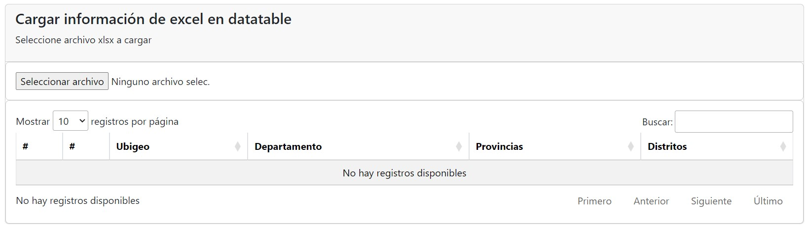
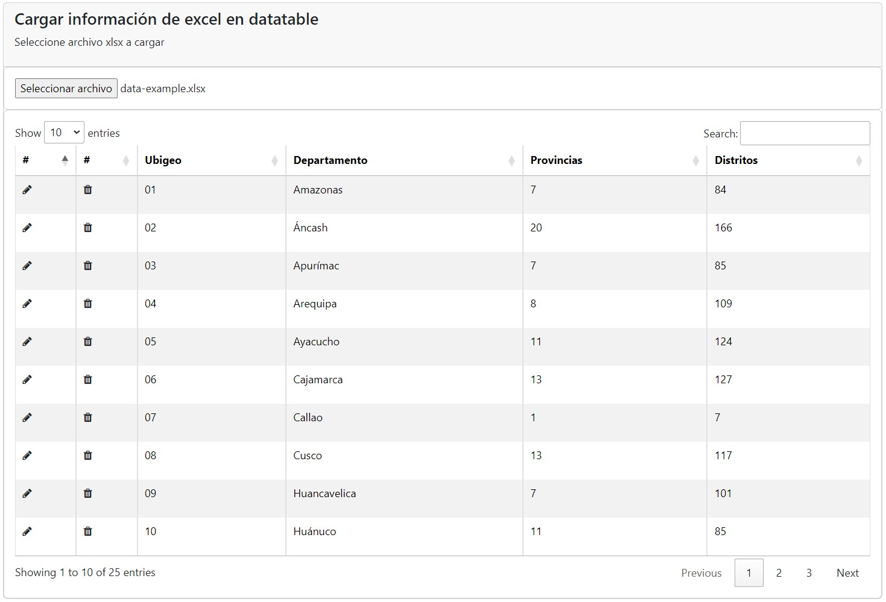

# DemoDatatables

This project was generated with [Angular CLI](https://github.com/angular/angular-cli) version 15.2.9.

## Development server

Run `ng serve` for a dev server. Navigate to `http://localhost:4200/`. The application will automatically reload if you change any of the source files.

## Code scaffolding

Run `ng new demo-datatables` to generate a new project.

Run `ng g m layout` to generate a new module.

Run `ng g c pages/data-load --module ../app/layout/layout.module --skip-tests` to generate component and add to layout module.

Run `ng add angular-datatables` to add angular-datatables library.

Run `ng g s service/excel --skip-tests` to generate a new excel service.

Run `npm i fontawesome-4.7` to add front-awesome 4.7 icons.

## Build

Run `ng build` to build the project. The build artifacts will be stored in the `dist/` directory.

## Running unit tests

Run `ng test` to execute the unit tests via [Karma](https://karma-runner.github.io).

## Running end-to-end tests

Run `ng e2e` to execute the end-to-end tests via a platform of your choice. To use this command, you need to first add a package that implements end-to-end testing capabilities.

## Further help

To get more help on the Angular CLI use `ng help` or go check out the [Angular CLI Overview and Command Reference](https://angular.io/cli) page.
